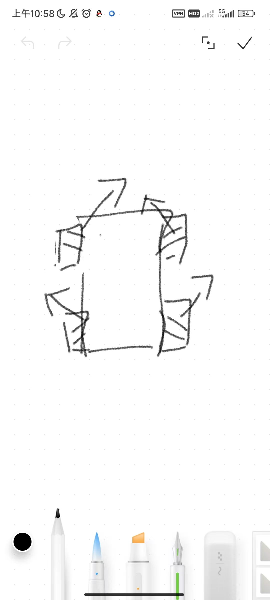

# CHASSIS
## TODO 
- 要将底盘应用后续移植到H7的板子
- 哨兵UI部分删除
- 改成单板通信

## 声明
- `GimbalUsed`
`static attitude_t *gimbal_IMU_data;` 云台IMU数据
`static DJIMotorInstance *yaw_motor, *pitch_motor;`云台yaw、pitch电机数据

-  `CommUsed` 用于和`cmd`进行数据交互
`static BoardCommInstance *chassis_can_comm;`             // 双板通信CAN comm   （换成单板通信后可删除）
`static Chassis_Ctrl_Cmd_s chassis_cmd_recv;`             // 底盘接收到的控制命令（发布中心发给底盘的）
`static Chassis_Upload_Data_s chassis_feedback_data;`     // 底盘回传的反馈数据
`static Referee_Interactive_info_t ui_data;`              // UI数据，将底盘中的数据传入此结构体的对应变量中，UI会自动检测是否变化，对应显示UI
`static referee_info_t* referee_data;`                    // 用于获取裁判系统的数据

## 初始化 `void ChassisInit();`

-  ` Motor_Init_Config_s chassis_motor_config = {};`设置电机初始化结构体(包括设置can通信如句柄，设置pid、电机型号) 
    单独设置id与电机正反装
```c
    chassis_motor_config.can_init_config.tx_id = 0x201;,
    chassis_motor_config.controller_setting_init_config.motor_reverse_flag = MOTOR_DIRECTION_NORMAL;
```
-   `motor_lf = DJIMotorInit(&chassis_motor_config);`将初始化结构体传给四个电机实例，并初始化四个电机实例
-   `referee_data   = UITaskInit(&huart6,&ui_data); `裁判系统数据初始化，传入串口句柄及ui_data

- 设置发布者用于发布云台反馈出来的信息
    `gimbal_pub = PubRegister("gimbal_feed", sizeof(Gimbal_Upload_Data_s));`
- 设置订阅者，订阅云台的控制信息
    `gimbal_sub = SubRegister("gimbal_cmd", sizeof(Gimbal_Ctrl_Cmd_s));   ` 
- 设置双板通信，设置双板通信初始化结构体包括(can句柄、发送、接收id、数据长度),将初始化结构体传给双板通信实例，并初始化双板通信实例
```c
    BoardComm_Init_Config_s comm_conf = {
    };
    chassis_can_comm = BoardCommInit(&comm_conf); // can comm初始化
```
## 功能
- `void  ChassisStateSet()`云台状态设定，无力模式让电机停止，运动模式让他cmd给的控制信息控制云台
- `void ChassisRotateSet()`旋转速度设定（这里不用底盘跟随，是因为云台是不断巡逻的，当然也可以在遥控器模式下使用这个底盘跟随模式）
- `MecanumCalculate();`麦轮解算

- `ChassisOutput()`计算后给各个电机设定值
- `SendChassisData()` 计算真实速度给巡航.
```c
    chassis_info.vx = (motor_lf->measure.speed_aps +motor_lb->measure.speed_aps - motor_rb->measure.speed_aps - motor_rf->measure.speed_aps) / 4.0f / REDUCTION_RATIO_WHEEL / 360.0f * PERIMETER_WHEEL/1000 ;
    chassis_info.vy = (-motor_lf->measure.speed_aps +motor_lb->measure.speed_aps + motor_rb->measure.speed_aps - motor_rf->measure.speed_aps) / 4.0f / REDUCTION_RATIO_WHEEL / 360.0f * PERIMETER_WHEEL/1000  ;
    chassis_feedback_data.real_vx = chassis_info.vx * chassis_info.cos_theta + chassis_info.vy * chassis_info.sin_theta;
    chassis_feedback_data.real_vy = -chassis_info.vx * chassis_info.sin_theta + chassis_info.vy * chassis_info.cos_theta;
```
`measure.speed_aps`是电机未经过减速箱的速度，所以要除以减速箱系数`REDUCTION_RATIO_WHEEL`，四个轮子，所以将合速度除四（eg.假设四个轮子速度为10m/s，那么就是先将轮子速度叠加成40m/s，再除4，得到车体的速度是10m/s），/360（转成弧度制），*轮子周长（将角速度转换成线速度），除1000（将cm/s转换成m/s）。然后再得到底盘坐标系转换到云台坐标系上。（去年漏了这步）

- `SendJudgeData()`获取裁判系统信息，将裁判系统信息（用什么发什么，别贪方便把啥都发给cmd）发布给终端（cmd）最终发给小电脑。

## 任务
`void ChassisTask()`
- 获取新的控制信息
- 底盘动与不动
- 旋转模式及速度设定
- 根据云台和底盘的角度offset将控制量映射到底盘坐标系
- 根据控制模式进行正运动学解算,计算底盘各个电机的速度
- 设定闭环参考值
- 将裁判系统的信息发给巡航，让其进行决策。
- 根据电机的反馈速度计算真实速度发给巡航
- 发送反馈信息给cmd
