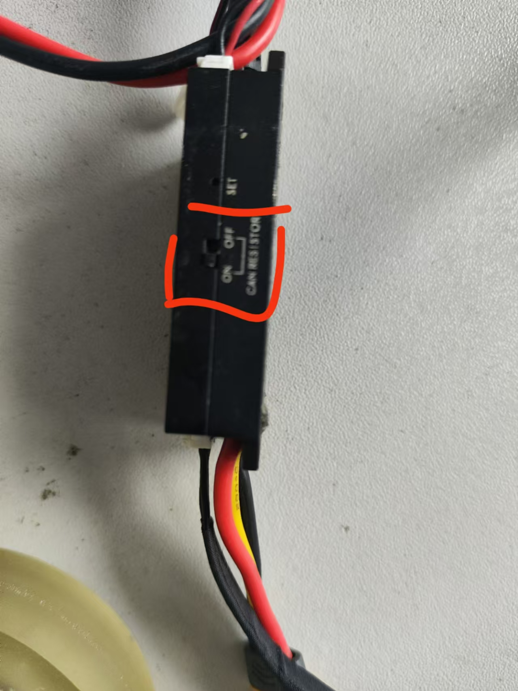
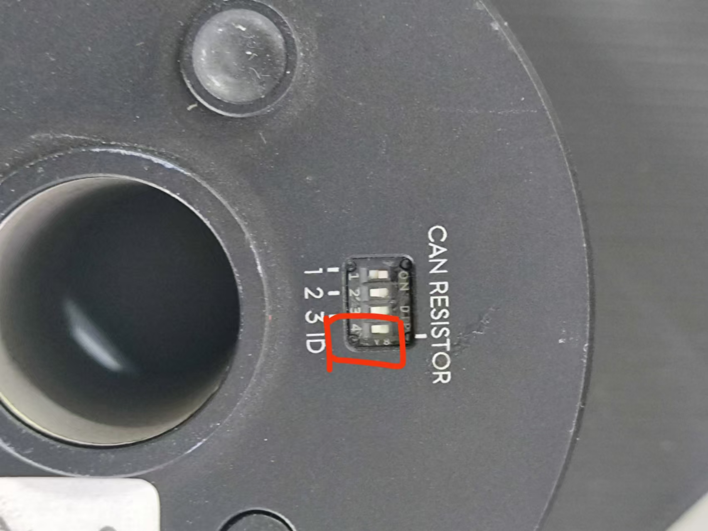
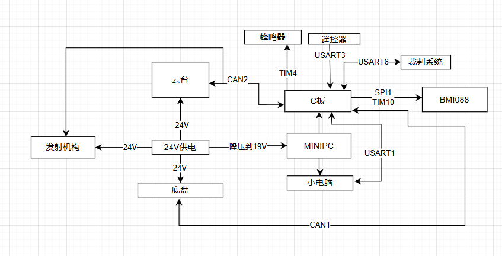
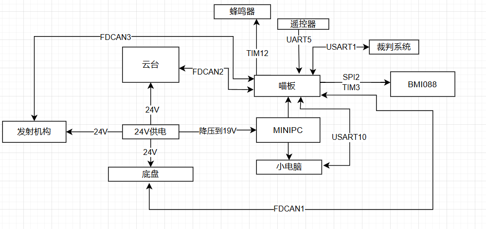
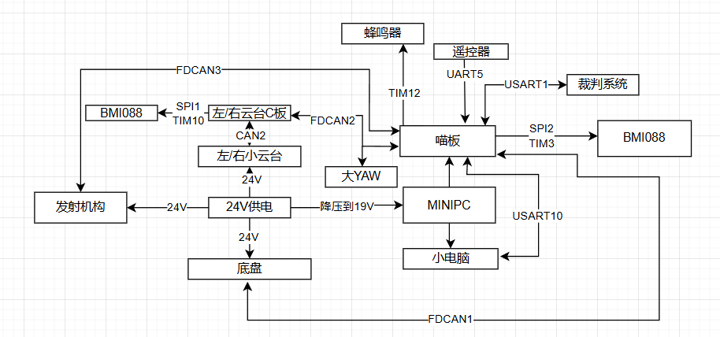

# bsp_can

## 注意事项：
请注意使用CAN设备的时候务必保证总线只接入了2个终端电阻(CAN_REGISTER)！开发板一般都有一个，6020电机、c620/c610电调、LK电机都有终端电阻，注意把多于2个的全部断开（通过拨码）

之前我们的英雄就是因为这个问题，一直无法接那么多个负载，所以说如果遇到无法驱动多个电机的时候，请务必注意使用CAN设备的时候务必保证总线只接入了2个终端电阻！

 

## 各个模块用到的CAN设备：(主控板还要和功率控制板通信用CAN1)
F4 通信（单板）流程图（后续仅新步兵用）:

老步兵、英雄、老哨兵等所有机器人都全换成H7开发板：

未来双头烧饼：

## .c中的函数：
### CAN初始化：
主要实现两个功能，一个用于添加过滤器、另外一个用于启用CAN服务。
- 添加过滤器：
这里将其配置为前14个过滤器给CAN1使用,后14个被CAN2使用
初始化时,奇数id的模块会被分配到FIFO0,偶数id的模块会被分配到FIFO1
注册到CAN1的模块使用过滤器0-13,CAN2使用过滤器14-27
`static void CANAddFilter(CANInstance *_instance);`
- 启用CAN服务：
```c
    HAL_CAN_Start(&hcan1);
    HAL_CAN_ActivateNotification(&hcan1, CAN_IT_RX_FIFO0_MSG_PENDING);
    HAL_CAN_ActivateNotification(&hcan1, CAN_IT_RX_FIFO1_MSG_PENDING);
    HAL_CAN_Start(&hcan2);
    HAL_CAN_ActivateNotification(&hcan2, CAN_IT_RX_FIFO0_MSG_PENDING);
    HAL_CAN_ActivateNotification(&hcan2, CAN_IT_RX_FIFO1_MSG_PENDING);
```

### 两个外部接口：（在模块层被调用）
- 注册CAN：（调用前要设置被cv进去的三个参数）
（用于板间、电机通信初始化）避免重复注册，避免注册过多，给实例分配内存，并全部置0。将你设置的参数结构体传到实例的结构体
`CANInstance *CANRegister(CAN_Init_Config_s *config)`

- 发送：
`uint8_t CANTransmit(CANInstance *_instance, float timeout);`

### 对HAL（can.h）的回调函数的重定义(你可能发现以下函数并不在bsp_can.h里。其实是对HAL（can.h）的回调函数的重定义)
- 接收：
`void HAL_CAN_RxFifo0MsgPendingCallback(CAN_HandleTypeDef *hcan);`
`void HAL_CAN_RxFifo1MsgPendingCallback(CAN_HandleTypeDef *hcan);`
调用模块层里设置的回调函数


- 每定义一个`can_instance`，就代表一个串口的**实例**（对象）。一个串口实例内有接收buffer，单个数据包的大小，CAN对应的`HAL handle`（代表其使用的can硬件具体是哪一个）以及用于解包数据的回调函数。

## 使用示例 (在模块层使用)(应用层设置can句柄、id)
```c
typedef struct
{
    CAN_Init_Config_s can_init_config;
}Motor_Init_Config_s;

    Motor_Init_Config_s *config;
    config->can_init_config.can_module_callback = DecodeDJIMotor; // set callback
    config->can_init_config.id = instance;                        // set id,eq to 
    instance->motor_can_instance = CANRegister(&config->can_init_config);
```
