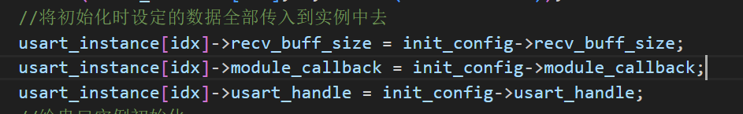

# 串口
## 各个模块用到的串口
（H723用到：视觉：1 遥控器：5 裁判系统：10）
（F407用到：视觉：1 遥控器：3 裁判系统：6）
## .c中的函数：
### 串口接收初始化：
```c
//DMA（直接存储器访问）传输完成后触发中断即
  HAL_UARTEx_ReceiveToIdle_DMA(_instance->usart_handle,_instance->recv_buff, _instance->recv_buff_size);
//因为传输完成后也会触发半接收中断，所以要关闭半接收中断；
__HAL_DMA_DISABLE_IT(_instance->usart_handle->hdmarx, DMA_IT_HT);
```

### 两个外部接口：（在模块层被调用）
- 注册串口：（调用前要设置被cv进去的三个参数）
（用于遥控器、小电脑、裁判系统的串口通信初始化）避免重复注册，避免注册过多，给实例分配内存，并全部置0。将你设置的参数结构体传到实例的结构体，再调用串口接收初始化			
`USARTInstance *USARTRegister(USART_Init_Config_s *init_config);`

- 发送：
`void USARTSend(USARTInstance _instance, uint8_t send_buf, uint16_t send_size, USART_TRANSFER_MODE mode) ;`//主要用DMA
size务必小于你创建的buff的大小，否则造成指针越界。      
### 对HAL（huart.h）的回调函数的重定义(你可能发现以下函数并不在bsp_huart.h里。其实是对HAL（huart.h）的回调函数的重定义)
- 接收：
`void HAL_UARTEx_RxEventCallback(UART_HandleTypeDef *huart, uint16_t Size);`
调用模块层里设置的回调函数，
错误回调：
void HAL_UART_ErrorCallback(UART_HandleTypeDef *huart)
写个看门狗，接收不到数据就重启。
## .h中的类型定义
```c
#define DEVICE_USART_CNT 3        // 只用到3个串口
#define USART_RXBUFF_LIMIT 128  //  最大的接收缓存区大小

typedef void (*usart_module_callback)(); // 解析收到的数据的回调函数
typedef struct
{
    uint8_t recv_buff[USART_RXBUFF_LIMIT]; 
    uint8_t recv_buff_size;                   // 实际的缓冲区长度
    UART_HandleTypeDef *usart_handle;      // 实例对应的串口句柄
    usart_module_callback module_callback; // 解析收到的数据的回调函数
} usart_instance;
```
- 每定义一个`usart_instance`，就代表一个串口的**实例**（对象）。一个串口实例内有接收buffer，单个数据包的大小，该串口对应的`HAL handle`（代表其使用的串口硬件具体是哪一个）以及用于解包数据的回调函数。

## 使用示例 (在模块层使用)
`USARTInstance *USARTRegister(USART_Init_Config_s *init_config);`
```c
    //注册串口函数`USARTInstance *USARTRegister(USART_Init_Config_s *init_config);`的使用示例
    static USARTInstance *rc_usart_instance;
    USART_Init_Config_s conf;
    conf.module_callback = RemoteControlRxCallback;
    conf.usart_handle = rc_usart_handle;
    conf.recv_buff_size = REMOTE_CONTROL_FRAME_SIZE;
    rc_usart_instance = USARTRegister(&conf);
```
`void USARTSend(USARTInstance *_instance, uint8_t *send_buf, uint16_t send_size, USART_TRANSFER_MODE mode); `

```c
static USARTInstance *referee_usart_instance; // 裁判系统串口实例
static uint8_t *send;
static uint16_t tx_len;
USARTSend(referee_usart_instance, send, tx_len, USART_TRANSFER_DMA);
```
