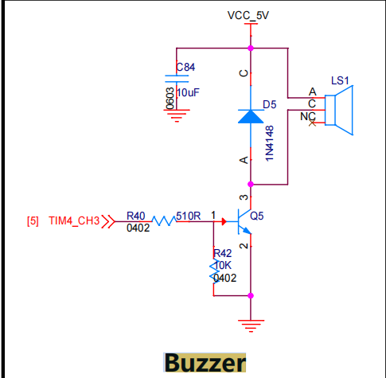

# buzzer

定时器4，通道3
## 注册模块
```c
//将初始化用到的数据结构体传入注册函数
static PWMInstance *buzzer;
void BuzzerInit()
{
    PWM_Init_Config_s buzzer_config = {
        .htim = &htim4,
        .channel = TIM_CHANNEL_3,
        .dutyratio = 0,
        .period = 0.001,
    };
    buzzer = PWMRegister(&buzzer_config);
}
```
虽然我们只有一个蜂鸣器，但是我们可以不同功能的蜂鸣器设置不同的优先级。来使用想用到的蜂鸣器。
`BuzzzerInstance *BuzzerRegister(Buzzer_config_s *config)`
用于注册一种功能的蜂鸣器

`void AlarmSetStatus(BuzzzerInstance *buzzer, AlarmState_e state);`开关蜂鸣器

`void BuzzerTask();`用在实时操作系统中，`buzz = buzzer_list[i];`
 相当于一种功能的蜂鸣器（例如可以有检测通信故障、识别目标等）
